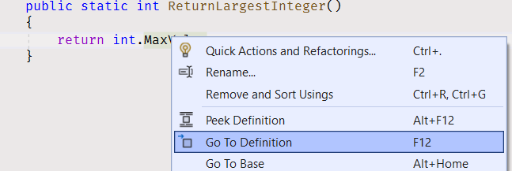

# Literals

A beginner level task for practicing integer numbers.

Estimated time to complete the task - 1h.

The task requires .NET 6 SDK.


## Task Description

The task has five sections with small sub-tasks in the code files.

Read [Built-in value types](https://docs.microsoft.com/en-us/dotnet/csharp/language-reference/builtin-types/value-types#built-in-value-types) section.


### Integer Literals

Read [Integral numeric types](https://docs.microsoft.com/en-us/dotnet/csharp/language-reference/builtin-types/integral-numeric-types) article.


#### _int_ and _uint_ data types

Open [Integers.cs](Integers/Integers.cs) file, and implement all methods using the information from the table below.

| Method Name      | Number         | Literal Type | Suffix |
|------------------|----------------|--------------|--------|
| ReturnInteger11  | 0              | Decimal      |        |
| ReturnInteger12  | 1              | Decimal      |        |
| ReturnInteger13  | -1             | Decimal      |        |
| ReturnInteger14  | 2,147,483,647  | Decimal      |        |
| ReturnInteger15  | -2,147,483,648 | Decimal      |        |
| ReturnInteger16  | 1              | Decimal      | u      |
| ReturnInteger17  | 3,2767         | Decimal      | u      |
| ReturnInteger18  | 2,147,483,647  | Decimal      | u      |

Start with the first method - [ReturnInteger11](Integers/Integers.cs#L7):

```cs
public static int ReturnInteger11()
{
    // TODO #1-1. Return "0" literal.
    throw new NotImplementedException();
}
```

The [throw](https://docs.microsoft.com/en-us/dotnet/csharp/language-reference/keywords/throw) keyword signals the occurence of an exception during program execution. In this method _throw new NotImplementedException()_ code signals that the method is not implemented.

Replace the _throw new NotImplementedException()_ code with _return 0_ statement:

```cs
public static int ReturnInteger11()
{
    // TODO #1-1. Return "0" literal.
    return 0;
}
```

The [return](https://docs.microsoft.com/en-us/dotnet/csharp/language-reference/keywords/return) statement terminates the method execution and returns "0" as a return value. "0" is the [decimal literal](https://docs.microsoft.com/en-us/dotnet/csharp/language-reference/builtin-types/integral-numeric-types#integer-literals).

Remove the TODO comment:

```cs
public static int ReturnInteger11()
{
    return 0;
}
```

Sonar will raise an [#1135 issue](https://rules.sonarsource.com/csharp/RSPEC-1135) for each TODO comment during a task check.

The [digit separator](https://docs.microsoft.com/en-us/dotnet/csharp/language-reference/builtin-types/integral-numeric-types#integer-literals) may improve the readability of large numeric literals. Use the digit separator symbol in this task for number literals with *more then 3 digits*.

```cs
public static int ReturnInteger14()
{
    return 2_147_483_647;
}
```

To specify the number literal is _unsigned_ use **u** or **U** suffixes:

```cs
public static uint ReturnInteger16()
{
    return 1u;
}
```

In your own code you can often skip these suffixes, because the compiler will understand that the literal is unsigned. But for the sake of learning we ask you to add suffixes in this task.


#### _long_ and _ulong_ data types

Open [LongIntegers.cs](Integers/LongIntegers.cs) file, and implement all methods using the information from the table below.

| Method Name          | Number                     | Literal Type | Suffix |
|----------------------|----------------------------|--------------|--------|
| ReturnLongInteger21  | 4,956,185,095,298,947,214  | Decimal      | L      |
| ReturnLongInteger22  | -1,280,010,762,458,239,942 | Decimal      | L      |
| ReturnLongInteger23  | -945,783,496,234,828,465   | Decimal      | L      |
| ReturnLongInteger24  | 16,269,823,234,523,742,845 | Decimal      | L      |
| ReturnLongInteger25  | 9,223,372,036,854,775,807  | Hexadecimal  | L      |
| ReturnLongInteger26  | 773,738,404,492,802,748    | Hexadecimal  | L      |
| ReturnLongInteger27  | 17,977,307,477,258,691,517 | Hexadecimal  | L      |
| ReturnLongInteger28  | 14,193,065,825,095,688,383 | Hexadecimal  | uL     |
| ReturnLongInteger29  | 4,100,761,908,933,204,629  | Binary       | L      |
| ReturnLongInteger210 | 13,645,102,583,813,967,509 | Binary       | uL     |
| ReturnLongInteger211 | 6,148,914,691,236,517,205  | Binary       | L      |
| ReturnLongInteger212 | 18,446,744,073,709,551,615 | Binary       | uL     |

Use **L** suffix to specify that a number literal is a _long integer_:

```cs
public static long ReturnLongInteger21()
{
    return 4_956_185_095_298_947_214L;
}
```

If you will put **l** suffix you will get [CS0078 warning](https://docs.microsoft.com/en-us/dotnet/csharp/misc/cs0078).


In methods with _Hexadecimal_ literal type use [hexadecimal literals](https://docs.microsoft.com/en-us/dotnet/csharp/language-reference/builtin-types/integral-numeric-types#integer-literals). See [Convert Numbers](convert-numbers.md) tutorial for more information on how to convert decimal numbers.

```cs
public static long ReturnLongInteger25()
{
    return 0x7FFF_FFFF_FFFF_FFFFL;
}
```

In methods with _Binary_ literal types use [binary literals](https://docs.microsoft.com/en-us/dotnet/csharp/language-reference/builtin-types/integral-numeric-types#integer-literals). See [Convert Numbers](convert-numbers.md) tutorial for more information on how to convert decimal numbers.

```cs
public static long ReturnLongInteger29()
{
    return 0b0011100011101000110101010011101010111010011010101001101010010101L;
}
```

## Type Aliases

In the [Characteristics of the integral types](https://docs.microsoft.com/en-us/dotnet/csharp/language-reference/builtin-types/integral-numeric-types#characteristics-of-the-integral-types) table there are ".NET type" and "C# type" columns which represent a .NET data type and a C# language type _alias_.

_int_ type is an alias for _System.Int32_ data type. Use the table to find corresponding .NET data types for _uint_, _long_ and _ulong_ aliases.


## Constants

Read [Constants](https://docs.microsoft.com/en-us/dotnet/csharp/programming-guide/classes-and-structs/constants) article, open [Consts.cs](Integers/Consts.cs) file, and implement all methods using the information from the table below.

| Method Name                       | Data Type | Value    |
|-----------------------------------|-----------|----------|
| ReturnLargestInteger              | int       | largest  |
| ReturnSmallestInteger             | int       | smallest |
| ReturnLargestUnsignedInteger      | uint      | largest  |
| ReturnSmallestUnsignedInteger     | uint      | smallest |
| ReturnLargestLongInteger          | long      | largest  |
| ReturnSmallestLongInteger         | long      | smallest |
| ReturnLargestUnsignedLongInteger  | ulong     | largest  |
| ReturnSmallestUnsignedLongInteger | ulong     | smallest |

Integer data types contains constants that represent the largest and smallest possible values. Return the relevant constant. You may find a list of type constants in a type documentation (links are in "See also" section).

Return [Int32.MaxValue](https://docs.microsoft.com/en-us/dotnet/api/system.int32.maxvalue) constant value in the [ReturnLargestInteger](Integers/Consts.cs#L5) method.

```cs
public static int ReturnLargestInteger()
{
    return int.MaxValue;
}
```

You can navigate to the constant definiton with [Go To Definition](https://docs.microsoft.com/en-us/visualstudio/ide/go-to-and-peek-definition) menu item to see the actual constant value.




## Fix Compiler Issues

Additional style and code checks are enabled for the projects in this solution to help you maintaining consistency of the project source code and avoiding silly mistakes. [Review the Error List](https://docs.microsoft.com/en-us/visualstudio/ide/find-and-fix-code-errors#review-the-error-list) in Visual Studio to see all compiler warnings and errors.

If a compiler error or warning message is not clear, [review errors details](https://docs.microsoft.com/en-us/visualstudio/ide/find-and-fix-code-errors#review-errors-in-detail) or google the error or warning code to get more information about the issue.


## Task Checklist

1. Rebuild the solution.
1. Fix all compiler warnings and errors.
1. Run all unit tests, make sure all unit tests completed successfully.
1. Review all changes, make sure the only code files (.cs) in Integers project have changes. No changes in project files (.csproj) or in Integers.Tests project.
1. Stage your changes, and create a commit.
1. Push your changes to remote repository.


## See also

* C# Language Reference
  * [Integral numeric types](https://docs.microsoft.com/en-us/dotnet/csharp/language-reference/builtin-types/integral-numeric-types)
  * [return](https://docs.microsoft.com/en-us/dotnet/csharp/language-reference/keywords/return)
  * [throw](https://docs.microsoft.com/en-us/dotnet/csharp/language-reference/keywords/throw)
* C# Programming Guide
  * [Constants](https://docs.microsoft.com/en-us/dotnet/csharp/programming-guide/classes-and-structs/constants)
* .NET API
  * [Int32 Struct](https://docs.microsoft.com/en-us/dotnet/api/system.int32)
  * [UInt32 Struct](https://docs.microsoft.com/en-us/dotnet/api/system.uint32)
  * [Int64 Struct](https://docs.microsoft.com/en-us/dotnet/api/system.int64)
  * [UInt64 Struct](https://docs.microsoft.com/en-us/dotnet/api/system.uint64)