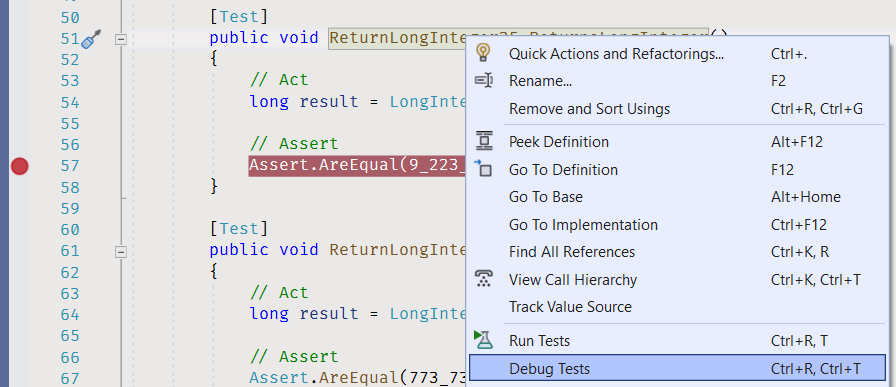
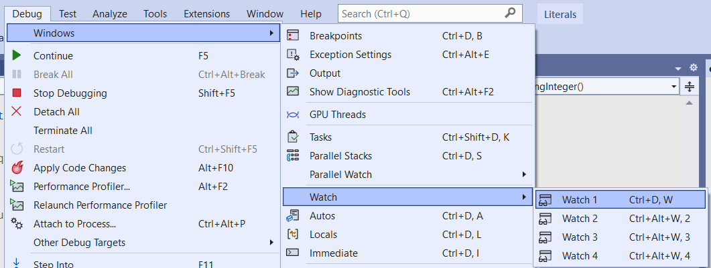
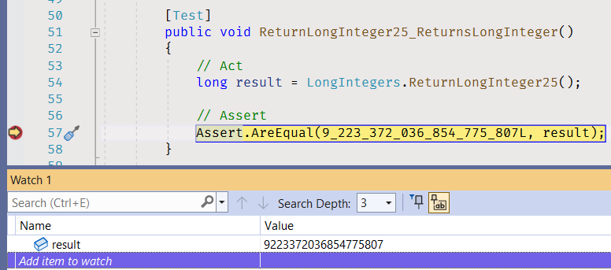
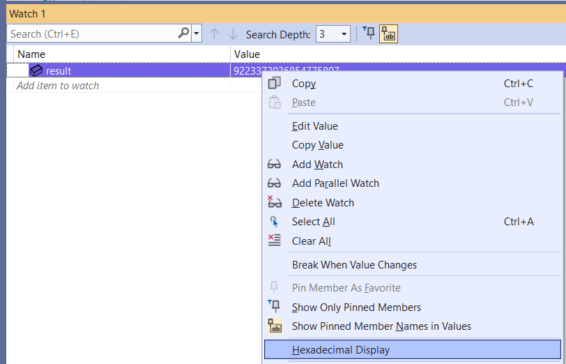
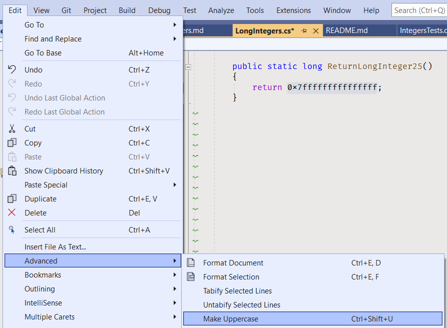
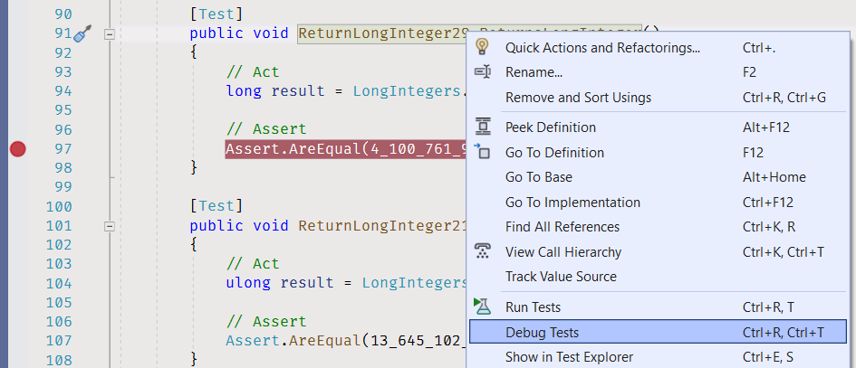
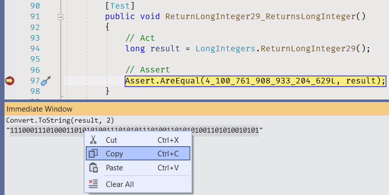

# Literals

## Convert Numbers

This tutorial shows how to use Visual Studio features for converting decimals to hexadecimal and binary numbers.


### Decimal to Hex

1. Navigate to [ReturnLongInteger25](Integers/LongIntegers.cs#L31) method, and return the expected value as _decimal literal_.

```cs
public static long ReturnLongInteger25()
{
    return 9_223_372_036_854_775_807L;
}
```

2. [Toggle a breakpoint](https://docs.microsoft.com/en-us/visualstudio/debugger/using-breakpoints) in [ReturnLongInteger25_ReturnsLongInteger](Integers.Tests/LongIntegersTests.cs#L53) unit test.


3. Debug the unit test.



4. Open [Watch window](https://docs.microsoft.com/en-us/visualstudio/debugger/watch-and-quickwatch-windows).



5. Add _result_ variable to the watch list.



6. Open a context menu for _result_ item and toggle _Hexadecimal Display_.



7. Open a context menu for _result_ item and copy the item value.


8. Stop the execution.

9. Paste the value to _ReturnLongInteger25_ method.

```cs
public static long ReturnLongInteger25()
{
    return 0x7fffffffffffffff;
}
```

10. Select the value in the code window, and make the selection uppercase.



11. Add digit separators and a suffix if necessary. For example, add **L** suffix for _long_ literal.

```cs
public static long ReturnLongInteger25()
{
    return 0x7FFF_FFFF_FFFF_FFFFL;
}
```


### Decimal to Binary

1. Navigate to [ReturnLongInteger29](Integers/LongIntegers.cs#L55) method, and return the expected value as a _decimal literal_.

```cs
public static long ReturnLongInteger29()
{
    return 4_100_761_908_933_204_629L;
}
```

2. [Toggle a breakpoint](https://docs.microsoft.com/en-us/visualstudio/debugger/using-breakpoints) in [ReturnLongInteger29_ReturnsLongInteger](Integers.Tests/LongIntegersTests.cs#L93) unit test.


3. Debug the unit test.



4. Open [Immediate window](https://docs.microsoft.com/en-us/visualstudio/ide/reference/immediate-window).


5. Add the code to the Immediate window. 

```cs
Convert.ToString(result, 2)
```


Run the code by pressing _Enter_.

6. Select the binary value in the Immediate window, and copy it.



7. Stop the execution.

8. Paste the value to _ReturnLongInteger29_ method.

```cs
public static long ReturnLongInteger29()
{
    return 11100011101000110101010011101010111010011010101001101010010101;
}
```

9. Add **0b** prefix to define a binary literal.

```cs
public static long ReturnLongInteger29()
{
    return 0b11100011101000110101010011101010111010011010101001101010010101;
}
```

10. Add digit separators and a suffix if necessary. For example, add *L* suffix for _long_ literal.

```cs
public static long ReturnLongInteger25()
{
    return 0b111000_11101000_11010101_00111010_10111010_01101010_10011010_10010101L;
}
```
